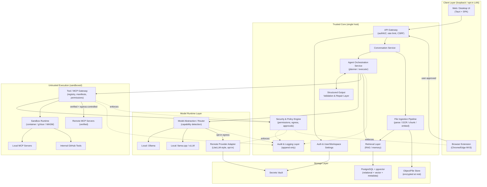
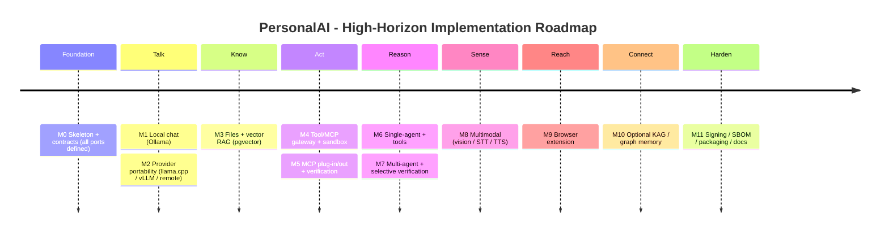

# PersonalAI High-Level Architecture Research Report

> Status: Research and high-level architecture only. No implementation.
> Date: 2026-06-05
> Scope: System shape, technology selection, security posture, and phased roadmap.

---

## 1. Executive Summary

**What PersonalAI is.** PersonalAI is a *local-first*, omni-capable assistant in the spirit of ChatGPT/Claude that runs open-source models on the user's own hardware, works with the user's own files and tools, and can *optionally* reach out to external model providers and external MCP servers only when the user explicitly configures and approves it. It is extensible (tools + MCP), structured-output-first (schemas everywhere), open-source-first (verified provenance only), and security-first (zero-trust toward tools, files, prompts, model outputs, and MCP servers).

**Recommended high-level shape.** A **single-host modular monolith backend** (one deployable service exposing clear internal module boundaries) that fronts a set of *isolated runtimes*:

- A **desktop/web UI** (Tauri shell wrapping a web SPA) talking to a **local API gateway** over loopback only.
- A **conversation + agent orchestration core** that produces and consumes **validated structured outputs**.
- A **Tool/MCP gateway** that is the *only* path to side effects, enforcing per-tool permissions and running every tool inside a **sandbox**.
- A **model runtime abstraction** that defaults to **Ollama** locally and routes to remote providers through a **LiteLLM**-style adapter only when configured.
- A **retrieval layer** built on **PostgreSQL + pgvector** (single store for relational + vector + metadata), with **Qdrant** as a documented scale-out alternative.
- Cross-cutting **security, audit, and secrets** layers that wrap every trust boundary.

Start as a modular monolith; split into separate services *only* where an isolation or scaling boundary forces it (model runtimes and tool sandboxes are already separate processes by design).

**Key design principles.** Local-first; structured-output-first; everything-is-untrusted (zero-trust); least privilege and explicit consent; verified-provenance dependencies; provider/runtime portability; observable and auditable by default.

**Biggest risks (ranked).**
1. **Prompt injection → tool misuse → data exfiltration.** The defining risk of agentic systems. The MCP spec itself states it "explicitly does not enforce security at the protocol level" — security is the implementor's job. ([MCP spec][mcp-spec], [Red Hat MCP risks][rh-mcp])
2. **Supply-chain / MCP provenance.** 30+ MCP CVEs were filed in early 2026, including CVE-2025-6514 (CVSS 9.6) in the widely used `mcp-remote` proxy. ([Wikipedia MCP][wiki-mcp])
3. **Untrusted-code execution from tools.** Containers share the host kernel; true isolation needs gVisor/microVM-class boundaries. ([SoftwareSeni isolation][ss-iso])
4. **Local resource limits (GPU/RAM)** constraining multimodal and larger models.
5. **Scope creep** across 7 phases diluting the security core. Mitigated by the roadmap below.

---

## 2. Design Principles

| # | Principle | What it means in practice |
|---|-----------|---------------------------|
| P1 | **Local-first, cloud-optional** | Full core functionality works offline. Any egress is opt-in, per-provider, and visible in the UI. |
| P2 | **Structured-output-first** | All agent↔backend↔tool↔UI messages are schema-validated (JSON Schema / Pydantic / Zod). Free text is a *rendered* artifact, not the transport. |
| P3 | **Zero-trust I/O** | Files, prompts, model outputs, tool results, and MCP servers are all treated as adversarial input. |
| P4 | **Least privilege + explicit consent** | Tools are off by default. Each grant is narrow, per-workspace, and revocable. Human-in-the-loop for high-risk actions. |
| P5 | **Verified provenance** | Every dependency has a known reputable maintainer, license, maturity, and a documented reason + alternative. |
| P6 | **Portability** | Swap local↔remote models and one vector store↔another behind stable interfaces. |
| P7 | **Auditable & reproducible** | Append-only audit log, SBOM, signed releases, reproducible builds where feasible. |

---

## 3. Proposed High-Level Architecture

**Topology.** One trust-controlled host (the user's machine or their self-hosted server). The UI and extension are *clients*; the backend binds to **loopback by default** and only exposes LAN/remote when the user opts in (with auth). Three categories of process exist:

1. **Trusted core** — UI shell, API gateway, conversation/agent/orchestration modules, schema validation, storage. Same trust domain.
2. **Semi-trusted runtimes** — local model servers (Ollama/llama.cpp/vLLM). Separate processes; constrained but not adversarial.
3. **Untrusted execution** — tools and MCP servers. Always sandboxed, network-egress-controlled, and behind the Tool/MCP gateway.

**Why a modular monolith first.** For a single-user/single-host product, microservices add operational cost (service mesh, inter-service auth, deployment complexity) without buying isolation that matters here — the isolation that matters is *tool sandboxing* and *model-runtime separation*, both of which are process/container boundaries regardless of how the core is packaged. Keep the core cohesive; isolate the dangerous parts.

---

## 4. Mermaid Architecture Diagram



---

## 5. Component Breakdown

> Recommended choices are marked **Recommended**; everything else is an alternative or open question.

### 5.1 Web/Desktop UI
- **Responsibility:** Chat, file workflows, model/tool/permission management, structured-output rendering, security warnings.
- **I/O:** User input/files → gateway; receives validated structured outputs to render.
- **Recommended tech:** **Tauri** desktop shell + a web SPA (**React** or **Svelte**) reusing the same code for web. Tauri's capability-based permission model and small/native-WebView footprint fit a security-first local app; it is governed under the Commons Conservancy. ([Markaicode Tauri/Electron][tauri], [Tauri governance][tauri])
- **Security:** Render untrusted model/tool output safely (no `dangerouslySetInnerHTML` without sanitization); strict CSP; no arbitrary remote script.
- **Open questions:** React vs Svelte; how much UI logic is shared between desktop and browser-extension surfaces.

### 5.2 Browser Extension
- **Responsibility:** Capture page context *on explicit user action*, send to backend, surface results.
- **I/O:** DOM selection/page text → backend over loopback; results back to a side panel/popup.
- **Recommended tech:** **Manifest V3**, minimal permissions, `activeTab` + on-demand host permissions, no broad `<all_urls>`.
- **Security:** Content scripts are a major risk surface; never auto-exfiltrate page content; authenticate to the localhost backend; user approval gate before any page read. (See §14.)

### 5.3 API Gateway
- **Responsibility:** Single entry point; authN/Z, rate limiting, CSRF/origin checks, request validation.
- **Recommended tech:** **FastAPI** (Python) *or* **NestJS/Fastify** (Node) — see backend §15 decision.
- **Security:** Bind loopback by default; token auth even locally; reject non-allowed origins (extension/UI only).

### 5.4 Auth & User/Workspace Settings
- **Responsibility:** Identity (even if single-user), workspace/project scoping, per-scope tool/model grants.
- **Recommended tech:** Local credential store + OS keychain; OAuth 2.1 only for *remote* MCP/providers, matching the MCP 2025-11-25 spec. ([MCP spec][mcp-spec])

### 5.5 Conversation Service
- **Responsibility:** Threads, turns, context assembly, attachment linkage, history persistence.
- **I/O:** User turns + retrieved context → orchestration; persists messages to Postgres.

### 5.6 Agent Orchestration Service
- **Responsibility:** Planner/executor loop, tool selection, memory/RAG calls, human-approval gating, retries/fallbacks.
- **Recommended tech:** **LangGraph** (graph-based, checkpointing, human-in-the-loop) as primary; **Microsoft Agent Framework** (AutoGen+Semantic Kernel successor, GA Q1 2026) as the alternative for .NET/enterprise paths. ([Langfuse comparison][langfuse], [MS Agent Framework][msaf])
- **Security:** Orchestrator never executes side effects directly — only via the Tool/MCP gateway. (See §7.)

### 5.7 Structured Output Validation & Repair Layer
- **Responsibility:** Validate every model/tool message against a schema; repair or reject on failure.
- **Recommended tech:** **Pydantic** (Python) / **Zod** (TS) for app schemas; **JSON Schema** as the canonical interchange; constrained decoding at the model layer (Ollama JSON-schema structured outputs; vLLM guided decoding). ([Ollama structured outputs][ollama-so], [vLLM structured outputs][vllm-so])

### 5.8 File Ingestion Pipeline
- **Responsibility:** Safe parse → OCR → chunk → embed → index.
- **Recommended tech:** **Apache Tika** (broad format detection/parsing, ASF) and/or **IBM Docling** (AI layout + tables, open-source from IBM Research) for richer PDFs. ([Procycons benchmark][docling], [Apache Tika guide][tika])
- **Security:** Treat every uploaded file as a malicious-document vector; parse inside a sandbox; strip active content; size/type limits.

### 5.9 Retrieval Layer (RAG + Memory)
- **Responsibility:** Hybrid search over chunks; short-term context + long-term memory.
- **Recommended tech:** **pgvector** in PostgreSQL (one store, transactional). ([pgvector vs Qdrant][pgq])

### 5.10 Model Runtime Layer
- See §6.

### 5.11 Tool/MCP Gateway + Sandbox
- See §8.

### 5.12 Security & Policy Engine
- **Responsibility:** Central decision point for permissions, egress, and approval prompts; enforces trust boundaries.
- **Security:** This is the chokepoint; everything dangerous routes through it. (See §12.)

### 5.13 Audit & Logging Layer
- **Responsibility:** Append-only record of tool calls, approvals, egress, model routing, schema failures.
- **Recommended tech:** Structured logs (OpenTelemetry) + an append-only audit table.

### 5.14 Storage Layer
- See §11.

---

## 6. Model Runtime Strategy

**Recommendation:** Default to **Ollama** for local serving and model management; abstract all access behind a **provider-router interface** (OpenAI-compatible) so **llama.cpp**, **vLLM**, and **remote providers via LiteLLM** are drop-in. Use **capability detection** to route by need (vision, embeddings, tool-calling, context length, structured output).

### Comparison

| Runtime | Maintainer | License | Best for | Structured output | Tool calling | GPU/CPU | Cross-platform | Notes |
|---|---|---|---|---|---|---|---|---|
| **Ollama** (Recommended local default) | Ollama | Open source (MIT) | Easy local model mgmt, pull/run, embeddings, vision models | **Yes** — native JSON-Schema-constrained outputs since v0.5 ([Ollama][ollama-so]) | Yes (function-calling models: llama3.x, qwen2.5, mistral-nemo, etc.) ([Ollama][ollama-so]) | Both; Metal/CUDA | macOS/Win/Linux | Lowest friction; great default. |
| **llama.cpp** | Georgi Gerganov / ggml-org | **MIT** | Max hardware reach, CPU-only, embedded; GGUF | Grammar/JSON constraints | Via templates | Both, CPU-strong | macOS/Win/Linux | Ollama builds on this lineage; ~109k★ (May 2026). ([llama.cpp][lcpp]) |
| **vLLM** | vLLM project (PyData/CNCF-adjacent OSS) | **Apache-2.0** | High-throughput GPU serving, multi-user | **Yes** — guided decoding (`guided_json`, regex, grammar) ([vLLM][vllm-so]) | Yes (OpenAI-compatible) | GPU-centric | Linux-first | Best when a real GPU/server is available. |
| **LiteLLM** (Recommended remote adapter) | BerriAI | **MIT** (Enterprise tier paid) | Unified gateway to 100+ providers in OpenAI format; cost tracking, guardrails, virtual keys | Passthrough | Passthrough | n/a (proxy) | Any | Use as the *remote* adapter + egress chokepoint. ([LiteLLM][litellm]) |
| **Hugging Face** (Transformers / TGI) | Hugging Face | Apache-2.0 | Model hub, weights, TGI serving, embeddings | Via libs | Via libs | Both | Any | Primary *source* of weights/embeddings; TGI as a serving alternative. |
| **LM Studio API** (alternative) | LM Studio (proprietary app) | Proprietary app, OpenAI-compatible API | Desktop GUI users | Model-dependent | Model-dependent | Both | macOS/Win/Linux | Useful as an *OpenAI-compatible endpoint*; app itself is not open source — keep optional, not core. |

**Embeddings.** Serve via Ollama or HF models (e.g., open embedding models). Keep the embedding model pinned and versioned because changing it invalidates the vector index.

**Vision / Audio.** Vision via multimodal models served by Ollama/vLLM. Audio: **faster-whisper** (SYSTRAN, CTranslate2; up to ~4x faster than `openai/whisper`) for STT, **Piper** (rhasspy) for local TTS. ([faster-whisper / Piper][whisper])

**GPU/CPU & cross-platform.** Ollama+llama.cpp cover CPU-only and Apple Silicon well; vLLM targets Linux+GPU. Detect hardware at install and recommend a default model tier accordingly. *(Uncertain: exact model picks depend on the user's RAM/VRAM — defer specifics to the LLM/Ollama specialist.)*

---

## 7. Agent Architecture

**Recommended pattern: orchestrated planner/executor, multi-agent capable, single-agent default.**

- **Default:** a single capable agent with tools. Multi-agent (role-specialized: planner, researcher, coder, critic) is opt-in for complex workflows to avoid unnecessary cost/latency.
- **Planner/Executor:** Planner proposes a typed plan (schema-validated); Executor runs steps. Plans are inspectable artifacts, not hidden chains.
- **Tool-calling flow:** model emits a **validated tool-call object** → Security Engine checks permission/egress → (if high-risk) **human approval gate** → sandboxed execution → result normalized to schema → back to agent.
- **Human-in-the-loop:** required for high-risk capabilities (filesystem writes, network egress, code execution, sending data out). LangGraph checkpointing supports pause/resume for approvals. ([Langfuse][langfuse])
- **Memory + RAG:** short-term (conversation window) + long-term (vector memory in pgvector), with explicit retrieval steps the user can see.
- **Agent-to-agent communication:** **structured messages only** (typed envelopes), never free-form text passing, so every hop is validatable and auditable.
- **Error handling:** schema-validation failure → bounded repair retries → safe fallback (ask user / abort) rather than executing unvalidated output.
- **Safe fallback:** when uncertain or when a tool is denied, the agent must degrade to a clarifying question, never silently widen scope or pick another tool to bypass a denial.

---

## 8. Tool and MCP Architecture

**The Tool/MCP gateway is the only path to side effects.** Nothing executes outside it.

- **MCP gateway design:** Brokers all MCP traffic; local MCP servers run sandboxed; remote MCP servers allowed only after verification and behind egress controls. OAuth 2.1 for remote per MCP 2025-11-25. Never pass user OAuth tokens through to downstream; do token exchange. ([MCP spec][mcp-spec], [CSA MCP best practices][csa-mcp])
- **Tool registry:** Central catalog of installed tools/MCPs with manifests, capabilities, permission grants, provenance, and enable/disable state per workspace.
- **Permission model:** Deny-by-default. Each tool declares the minimum capabilities; the user grants narrowly and revocably; the Security Engine enforces at call time.
- **Tool manifest (declared per tool/MCP):** `name`, `maintainer/provenance`, `version`, `capabilities`, `permissions` (fs/net/exec scopes), `inputs`/`outputs` (schemas), `egress` (allowed hosts), `risk level`, `signature/hash`.
- **Sandboxing:** tiered by risk — containers for low-risk, **gVisor or microVM (Firecracker/Kata)** for code execution / untrusted tools, **WASM (Wasmtime)** for pure-compute plugins with capability-denied-by-default I/O. Containers alone share the host kernel and are insufficient for truly untrusted code. ([SoftwareSeni isolation][ss-iso])
- **Allowlist/denylist:** Network egress allowlist per tool; default no network. Filesystem access scoped to a per-workspace jail.
- **Third-party MCP verification workflow:** provenance check (reputable maintainer) → license check → pin version + hash → review declared permissions → run sandboxed with egress off → promote only after explicit approval. Motivated directly by the 30+ early-2026 MCP CVEs incl. CVE-2025-6514 (CVSS 9.6). ([Wikipedia MCP][wiki-mcp])
- **User-developed GitHub tools:** treat as third-party until signed; pin to a commit/tag, generate SBOM, scan, run sandboxed first. Author trust ≠ code trust.
- **Per-scope enablement:** tools enabled per user → workspace → project, with the most restrictive scope winning.

---

## 9. Structured Output Architecture

- **Schema system:** Canonical **JSON Schema** for interchange; **Pydantic** (Python) / **Zod** (TS) as the authoring/runtime layer that generates and validates against it. Tool I/O, agent messages, and plans all have schemas.
- **Validation:** Validate at *every* boundary (model→backend, tool→backend, backend→UI). Constrain at generation time where supported: Ollama JSON-Schema structured outputs, vLLM guided decoding. ([Ollama][ollama-so], [vLLM][vllm-so])
- **Retry/repair:** On invalid output: (1) re-ask with the schema + error, bounded attempts; (2) deterministic repair where safe; (3) fail closed. Never execute unvalidated tool calls.
- **Versioning:** Schemas are versioned (`$id` + semver); messages carry their schema version; the validator supports N and N-1.
- **UI rendering:** Render typed outputs as components (tables, cards, file lists, diffs) rather than dumping text. Free text is one renderable field, not the whole payload.
- **Contracts:** Tool invocation contract = `{tool, version, args(schema), required_permissions}`. Agent message contract = typed envelope `{from, to, type, payload(schema), schema_version}`.

---

## 10. Omni-Capability Architecture

| Modality | Approach | Recommended tech |
|---|---|---|
| Text | Native | Local LLM via Ollama; structured outputs. |
| Files | Sandboxed parse → chunk → embed → index | Apache Tika / IBM Docling ([docling][docling], [tika][tika]) |
| Images (understand) | Multimodal model routing | Vision models via Ollama/vLLM |
| Images (generate) | Optional tool/provider | Local diffusion (opt-in) or remote (opt-in) |
| OCR | In ingestion pipeline | Tika/Docling pipelines; Tesseract as fallback |
| Audio → text | STT | **faster-whisper** (SYSTRAN, MIT/CTranslate2) ([whisper][whisper]) |
| Text → audio | TTS | **Piper** (rhasspy) ([whisper][whisper]) |
| Video | Deferred | Frame sampling + vision later (Phase 5+) |
| Multimodal routing | Capability-based router | Model abstraction layer (§6) selects by required capability |
| RAG/indexing | Hybrid retrieval | pgvector (§11) |
| Privacy | Local-by-default | Modality processing stays local unless a remote provider is explicitly chosen; egress is logged. |

---

## 11. Storage and Retrieval Architecture

**Recommendation: PostgreSQL as the spine.** Relational data, metadata, conversation history, and vectors (via **pgvector**) live in one transactional store — fewer moving parts, simpler backups, simpler local install.

| Concern | Recommended | Alternative | Why |
|---|---|---|---|
| Relational + metadata | **PostgreSQL** | SQLite (single-user desktop) | Mature, transactional, ubiquitous. |
| Vector / retrieval | **pgvector** | **Qdrant** (Apache-2.0, Rust) at scale | One store first; Qdrant when vector throughput/scale demands a dedicated engine. ([pgq][pgq]) |
| Object/file storage | Encrypted local filesystem store | MinIO (S3-compatible, self-host) | Local-first; S3 API only if needed. |
| Conversation history | Postgres tables | — | Co-located with everything else. |
| Long-term memory | pgvector + summarization | Qdrant; **graph-backed memory (KAG)** | Retrievable, scoped per workspace. |
| Secrets | OS keychain + encrypted vault | HashiCorp Vault (server mode) | Keep provider keys out of the DB. |
| Knowledge graph (optional, KAG) | **Deferred** — Postgres + Apache AGE (single-store) | Neo4j (dedicated) | Entity/relationship reasoning; add only when multi-hop/global queries demand it. |

**Local-first storage & encryption:** data at rest encrypted; per-workspace file jails; user owns and can export/delete everything. SQLite is a legitimate *desktop single-user* substitution for Postgres if we want a zero-dependency install — open question (§20).

### 11.1 Knowledge-Augmented Generation (KAG / GraphRAG) — optional hybrid layer

> **Status: not in v1. Documented as an optional Phase 4+ enhancement, not a replacement for vector RAG.**

**What it is.** Where vector RAG retrieves *semantically similar text chunks*, KAG first **extracts structured knowledge** — entities (people, projects, files, concepts) and the relationships between them — into a **knowledge graph**, then traverses/reasons over explicit facts at query time. (The term overlaps heavily with what Microsoft calls **GraphRAG**; there is also a specific framework literally named "KAG" from Ant Group/OpenSPG — here "KAG" means the general graph-backed approach, *not* that product, which would need separate verification.)

**Why add it.**
- **Multi-hop reasoning** across documents (chaining facts that live in no single chunk).
- **Fewer relationship hallucinations** — the model traverses explicit edges instead of inferring from loosely-similar text.
- **Global/aggregate questions** ("themes across all my notes") that top-k chunk retrieval cannot see.
- **Explainability/provenance** — answers can cite the entities and edges used (fits the audit + structured-output principles).
- **Durable long-term memory** — a graph is a natural substrate for accumulated facts about the user, projects, and files. *This is likely the highest-value use for PersonalAI, above document Q&A.*

**Costs / why deferred.**
- Graph extraction runs an LLM over the corpus — extra compute (painful on local hardware) and an additional, *lossy* accuracy surface of its own.
- Extra moving part to build/secure/maintain (graph store on top of pgvector).
- It is **additive**: best results come from **hybrid** retrieval (vector RAG to find relevant text + graph to reason over relationships), so it does not remove RAG work.

**Recommended path if/when adopted.** Keep it single-store first via **PostgreSQL + Apache AGE** (graph extension) alongside pgvector, so relational + vector + graph stay in one transactional database; promote to a dedicated **Neo4j** only if graph workloads outgrow it. Start KAG narrowly on **long-term memory**, not full-corpus document Q&A.

---

## 12. Security Architecture

**Threat model (assume adversarial): prompts, files, model outputs, tool results, and MCP servers are all untrusted.**

**Trust boundaries.**
1. Client ↔ Gateway (loopback, authenticated, origin-checked).
2. Core ↔ Model runtimes (separate processes; remote egress gated).
3. Core ↔ Tools/MCP (sandbox boundary — the critical one).
4. Host ↔ Remote (network egress allowlist).

**Controls by risk.**

| Threat | Control |
|---|---|
| Prompt injection | Treat retrieved/file/web content as data not instructions; structured tool-call validation; human approval for high-risk actions; egress allowlist so injected "exfiltrate to X" is blocked. ([rh-mcp][rh-mcp]) |
| Data exfiltration via tool chaining | Per-tool egress allowlist; default no network; audit every outbound call; capability composition review. ([wiki-mcp][wiki-mcp]) |
| Malicious documents | Sandboxed parsing; strip active content; type/size limits. |
| Unsafe tool execution | Tiered sandbox (container → gVisor → microVM/WASM); no host kernel trust for untrusted code. ([ss-iso][ss-iso]) |
| Insecure MCPs | Verification workflow; pin+hash; OAuth 2.1; no token passthrough. ([mcp-spec][mcp-spec], [csa-mcp][csa-mcp]) |
| Over-permissive agents | Deny-by-default; least-privilege grants; per-scope enablement. |
| Supply-chain / dependency confusion | Pin versions + hashes; private registry config; provenance policy (§5/P5). |
| Secret leakage | OS keychain/vault; never in prompts/logs; redaction in audit. |

**Assurance:** **SBOM** generation (CycloneDX/SPDX), **vulnerability scanning** (Trivy/Grype/`pip-audit`/`npm audit`), **signed releases** (Sigstore/cosign), reproducible builds where feasible, append-only **audit log**, controlled **update strategy** (signed, user-approved). **Data privacy model:** local-by-default; explicit, logged, per-provider egress; full export/delete.

---

## 13. UI/UX Architecture

- **Chat interface:** streaming responses; structured outputs rendered as components; clear local/remote provider badge per message.
- **Model selector:** shows model, capabilities (vision/tools/embeddings/context), and **local vs remote** indicator with a privacy warning on remote.
- **Tool management UI:** per-tool enable/disable, permission scopes, provenance, risk badge; nothing on by default.
- **Permissions UI:** approval prompts that state *what* a tool will do, *what data* it sees, and *where data goes*; remember-this-scope option.
- **File manager:** uploads, parse status, which workspace, delete/export.
- **Agent/workflow view:** visualize plan + steps + tool calls + approvals (LangGraph-style trace).
- **Settings:** providers/keys, egress allowlist, models, sandbox level.
- **Security warnings:** prominent for remote egress, new/unverified tools, untrusted files.
- **Extension interaction model:** explicit "capture this page" action, never automatic. (See §14.)

---

## 14. Browser Extension Architecture

- **Manifest V3**, minimal permissions: prefer `activeTab` + on-demand host permission grants over `<all_urls>`.
- **Content-script risk:** content scripts share the page's hostile DOM; never auto-collect or auto-send; sanitize before transport.
- **User approval before page access:** explicit click → consent → single capture. No background scraping.
- **Secure messaging with backend:** talk to the **localhost** backend over an authenticated channel (token), validate `origin`, and the backend must accept only known extension IDs.
- **Localhost API security:** loopback binding, token auth even locally, CSRF/origin checks; treat the extension as a semi-trusted client.
- **Data extraction boundaries:** capture only the user-selected scope (selection/visible page), show what will be sent before sending, log it in the audit trail.

*(Defer detailed MV3 design to the browser-extension specialist; the above is the security envelope.)*

---

## 15. Backend Architecture

- **API structure:** REST/HTTP + streaming (SSE/WebSocket) for chat; OpenAPI-described; schema-validated requests/responses.
- **Service boundaries (modular monolith):** conversation, orchestration, ingestion, retrieval, tool-gateway, security, audit as internal modules with clean interfaces; model runtimes and tool sandboxes are *separate processes* by design.
- **Message/queue:** start simple (in-process task runner). Introduce a real queue (**Redis**-backed, e.g. RQ/Celery/BullMQ) only for long-running ingestion/embedding jobs.
- **Auth/session:** local token-based; OAuth 2.1 only for remote MCP/providers.
- **Workspace/project model:** user → workspace → project; tool/model grants and file jails scoped here.
- **Background jobs:** ingestion, embedding, indexing, scans.
- **Observability:** **OpenTelemetry** traces/metrics/logs + the audit log; optional local **Langfuse** for agent traces.
- **Language decision (open):**
  - **Python (FastAPI)** — Recommended if the agent/ML ecosystem (LangGraph, Pydantic, Docling, faster-whisper, HF) is used directly in-process. Best ecosystem fit.
  - **Node/TypeScript (NestJS/Fastify)** — Recommended if maximizing shared types with the SPA/extension (Zod end-to-end) matters more than ML ecosystem proximity.
  - Likely outcome: **Python core** for AI/agents, with model runtimes and some tools as separate processes; TS only in UI/extension. (Decide in Phase 0.)

---

## 16. Deployment Architecture

| Mode | Shape | Notes |
|---|---|---|
| **Local desktop** (Recommended default) | Tauri app + bundled backend + Ollama | Loopback only; simplest privacy story. |
| **Local server** | Backend + Postgres + Ollama on a home server | LAN access opt-in with auth. |
| **Docker Compose** (Recommended for server) | Core + Postgres/pgvector + (optional) Qdrant + sandbox runtime | Reproducible self-host. |
| **Kubernetes** | Only if multi-user/team scale-out | Not justified for single-user; document as future. |
| **Offline mode** | No egress; local models only | First-class supported state. |
| **LAN mode** | Bind to LAN with auth + TLS | Opt-in, warned. |
| **Cloud mode** | Optional remote providers/MCP via LiteLLM | Per-provider opt-in, logged egress. |
| **Cross-platform** | macOS/Win/Linux | Ollama+llama.cpp cover all; vLLM is Linux+GPU; Tauri is cross-platform. |

---

## 17. Recommended Technology Stack

| Area | Recommended | Maintainer | License | Why | Risks | Alternatives |
|---|---|---|---|---|---|---|
| Local model serving | **Ollama** | Ollama | MIT (OSS) | Easiest local mgmt; native structured outputs + tool calling ([ollama-so][ollama-so]) | Newer ecosystem; perf below vLLM at scale | llama.cpp, vLLM, LM Studio API |
| Low-level inference | **llama.cpp** | ggml-org / G. Gerganov | MIT | Max hardware reach, GGUF, CPU ([lcpp][lcpp]) | Lower-level to operate | Ollama (wraps it) |
| GPU serving | **vLLM** | vLLM project | Apache-2.0 | Throughput + guided decoding ([vllm-so][vllm-so]) | Linux+GPU only | TGI (HF) |
| Remote provider gateway | **LiteLLM** | BerriAI | MIT (Enterprise paid) | 100+ providers, OpenAI format, egress chokepoint, cost/guardrails ([litellm][litellm]) | Enterprise features gated | Direct SDKs |
| Agent orchestration | **LangGraph** | LangChain | OSS (MIT) | Graph, checkpointing, HITL ([langfuse][langfuse]) | LangChain churn | MS Agent Framework ([msaf][msaf]) |
| Schemas (PY/TS) | **Pydantic / Zod** | Pydantic / Colin McDonnell | MIT | De-facto validation; JSON-Schema bridge | — | attrs, io-ts |
| Vector + relational | **PostgreSQL + pgvector** | PostgreSQL / pgvector | PostgreSQL License | One store, transactional ([pgq][pgq]) | Lower vector throughput at huge scale | Qdrant |
| Dedicated vector DB | **Qdrant** | Qdrant | Apache-2.0 | Rust engine, filtering, quantization ([pgq][pgq]) | Extra service | Weaviate, Milvus, Chroma, LanceDB |
| Document parsing | **Apache Tika** / **IBM Docling** | ASF / IBM Research | Apache-2.0 | Broad formats / AI layout+tables ([tika][tika], [docling][docling]) | Docling heavier (AI models) | Unstructured |
| STT | **faster-whisper** | SYSTRAN | MIT | ~4x faster Whisper ([whisper][whisper]) | GPU helps | openai/whisper, WhisperLive |
| TTS | **Piper** | rhasspy | MIT | Fast local neural TTS ([whisper][whisper]) | Voice quality vs cloud | Coqui-class alternatives |
| Desktop shell | **Tauri** | Tauri (Commons Conservancy) | MIT/Apache-2.0 | Small, secure, capability-based ([tauri][tauri]) | Smaller ecosystem than Electron; native WebView quirks | Electron |
| Sandbox (untrusted) | **gVisor** / **Firecracker** / **Wasmtime** | Google / AWS / Bytecode Alliance | Apache-2.0 (各) | Strong isolation tiers ([ss-iso][ss-iso]) | Linux-centric; Tauri capability model on desktop | Plain containers (insufficient alone) |
| Tool standard | **MCP** | Anthropic + community | Open standard (MIT SDKs) | Ecosystem interop ([mcp-spec][mcp-spec]) | Security is implementor's job; CVE history ([wiki-mcp][wiki-mcp]) | Bespoke tool API |
| Observability | **OpenTelemetry** (+ optional Langfuse) | CNCF / Langfuse | Apache-2.0 / MIT | Standard tracing; agent traces | — | Vendor APMs |
| Supply-chain | **CycloneDX/SPDX**, **Trivy/Grype**, **Sigstore/cosign** | OWASP/Linux Fdn / Aqua / OpenSSF | Apache-2.0 (各) | SBOM, scan, signing | Setup effort | Snyk (commercial) |

> *Uncertainty notes:* Some licenses (e.g., Ollama MIT, LangGraph MIT) should be re-verified at pin time from each repo's LICENSE file before adoption; this report's license claims are grounded in the cited sources but must be re-checked in Phase 0. vLLM governance/maintainer details beyond "Apache-2.0 OSS project" were not fully confirmable from search and are marked uncertain.

---

## 18. Phased Roadmap

| Phase | Goal | Exit criteria |
|---|---|---|
| **0 — Research & validation** | Confirm stack, language decision, license re-verification, threat model v1, schema conventions | ADRs written; SBOM/scan/signing pipeline skeleton; this report ratified |
| **1 — Local chat with Ollama** | Streaming chat over local models; provider abstraction; structured-output validation core; loopback auth | Chat works offline; badges show local; schemas validated |
| **2 — Files & RAG** | Ingestion (Tika/Docling) → pgvector retrieval; sandboxed parsing; per-workspace file jails | Upload→ask works; malicious-file parsing contained |
| **3 — Tools & MCP gateway** | Tool registry, manifests, permission model, sandbox tiers, MCP verification workflow, audit log | No side effect without gateway+approval; egress allowlist enforced |
| **4 — Structured multi-agent workflows** | LangGraph planner/executor; typed agent messages; HITL approvals; retries/fallbacks | Multi-step task with approval gates and full trace |
| **4+ — KAG / graph-backed memory (optional)** | Hybrid graph+vector retrieval; entity/relationship extraction (Postgres + Apache AGE first); start on long-term memory | Multi-hop/global question answered with entity-edge provenance; gated by whether RAG hits its limits (§11.1, §20) |
| **5 — Multimodal** | Vision routing; STT (faster-whisper); TTS (Piper); image gen optional | Image/audio in and out, local-first |
| **6 — Browser extension** | MV3, minimal perms, explicit capture, authenticated localhost messaging | Page capture only on user action; audited |
| **7 — Hardening & ecosystem** | Signed releases, reproducible builds, SBOM/scan in CI, packaging (desktop + Compose), docs | Release pipeline signed; security policy + user/admin docs published |

---

## 19. Risks and Tradeoffs

- **Security vs UX friction.** Deny-by-default + approval gates add clicks. Mitigate with remembered per-scope grants and clear, infrequent prompts.
- **Modular monolith vs microservices.** Monolith is simpler/safer to start; risk is module boundaries eroding. Mitigate with enforced internal interfaces and keeping dangerous parts as separate processes from day one.
- **pgvector vs dedicated vector DB.** One store is simpler but slower at large scale. Tradeoff is acceptable for single-user; Qdrant path documented.
- **Local model quality vs cloud.** Local models may underperform frontier cloud models. Mitigate with opt-in remote routing and honest capability badges.
- **Tauri vs Electron.** Tauri is smaller/more secure but has a smaller ecosystem and native-WebView inconsistencies. Electron is the safe fallback if WebView issues block delivery.
- **Sandbox strength vs cross-platform.** Strong isolation (gVisor/microVM) is Linux-centric; desktop macOS/Windows lean on Tauri capabilities + OS sandboxing + WASM for plugins. This is a genuine gap to design around.
- **MCP ecosystem risk.** Powerful but young and CVE-prone; the verification workflow is non-negotiable overhead.
- **Python vs Node core.** ML ecosystem (Python) vs end-to-end shared types (Node). Either works; pick in Phase 0.

---

## 20. Open Questions

1. **Backend language:** Python (FastAPI, ML-native) vs Node/TS (shared Zod types)? (Leaning Python core.)
2. **Single-user vs multi-user** from the start? Affects auth, workspaces, and whether SQLite is acceptable.
3. **SQLite vs PostgreSQL** for the desktop default (zero-dependency install vs one consistent store)?
4. **Desktop framework:** commit to Tauri, or hedge with Electron given WebView risk?
5. **Sandbox strategy on macOS/Windows** where gVisor/microVM aren't native — how strong can untrusted-tool isolation realistically be?
6. **Embedding model choice + versioning policy** (changing it reindexes everything).
7. **How aggressive is multi-agent by default** vs single-agent (cost/latency vs capability)?
8. **Image generation:** in-scope locally (heavy) or remote-only/opt-in?
9. **Update/distribution channel** and signing identity for releases.
10. **Default egress posture:** fully offline until configured, or pre-allow a curated set?
11. **KAG / knowledge graph (§11.1):** do we add a graph-backed hybrid layer at all, and if so — start on long-term memory or document Q&A? Single-store (Postgres + Apache AGE) or dedicated (Neo4j)? Is the extraction compute cost acceptable on local hardware? Default position: *defer to Phase 4+, RAG-first.*

---

## 21. Final Recommendation

Build PersonalAI as a **local-first modular monolith** with a **Tauri desktop shell**, a **Python (FastAPI) core**, **Ollama** as the default local runtime behind an **OpenAI-compatible model-router** (with **LiteLLM** as the opt-in remote adapter and **vLLM/llama.cpp** as alternative local backends), **PostgreSQL + pgvector** as the single relational+vector store, **LangGraph** for orchestration, and **Pydantic/Zod + JSON Schema** enforcing structured outputs at every boundary. Route **all** side effects through a **Tool/MCP gateway** that enforces deny-by-default permissions, runs tools in **tiered sandboxes**, controls **network egress with allowlists**, and writes an **append-only audit log** — with **MCP verification, SBOM, scanning, and signed releases** as hard requirements, not extras.

This is the safest and most practical starting point because it: (1) keeps the user's data and compute **local by default** with egress as a visible, logged, opt-in exception; (2) concentrates all danger (tools, MCP, remote providers, file parsing) **behind explicit chokepoints** that can be reasoned about and audited; (3) uses **boring, reputable, well-licensed** components with verifiable maintainers; (4) treats **every input as adversarial**, directly answering the dominant prompt-injection/exfiltration/supply-chain threats that the MCP ecosystem's own CVE record makes concrete; and (5) stays **portable** so local↔remote models and pgvector↔Qdrant can evolve without re-architecting. Start at Phase 1 (local chat) and earn each capability behind the security envelope before adding the next.

---

## 22. Modular Implementation Roadmap

This section turns the capability phases (§18) into an *implementation* plan whose central goal is **modularity**: adding a feature should mean **adding a new adapter behind an existing contract + a registry entry + a schema** — *not* editing the core. This keeps future changes (by humans or by Claude Code agents) **local and additive** instead of sweeping.

### 22.1 The modularity rule (read this first)

> **Golden rule:** New capability = **new adapter** implementing an existing **port** + **register it** + **declare its schema**. The orchestrator, gateway, storage interfaces, and message contracts stay stable.

This is **hexagonal architecture (ports & adapters) + registries**. The core depends only on *interfaces*; concrete implementations are plugged in at the edges and discovered through registries. Contract-first means a change is contained to one adapter and its schema, with consumers opting in by schema version.

### 22.2 The seams (stable extension points)

Each seam is the *one place* you extend for a class of feature. Touching the seam should not require touching the others.

| Seam (extension point) | Stable contract | Add a feature by… | Core code touched |
|---|---|---|---|
| **Model providers** | `ModelProvider` port (OpenAI-compatible: generate, embed, capabilities) | New adapter (e.g. vLLM, remote) + register | None — registry lookup |
| **Tools / MCP** | Tool **manifest** + handler contract (§8) | Drop manifest + sandboxed handler; verify; grant | None — gateway loads registry |
| **Retrieval** | `Retriever` port (query → ranked, cited results) | New strategy (vector / keyword / **graph-KAG**) + register | None — orchestrator calls the port |
| **Storage** | Repository ports (relational, vector, object, graph) | New repo adapter (e.g. Qdrant, Neo4j) | None — DI swaps the adapter |
| **Modalities** | `ModalityHandler` (parse / OCR / transcribe / synthesize / render) | New handler keyed by MIME/modality + register | None — pipeline dispatches by type |
| **Agents / roles** | `AgentRole` + LangGraph node contract | New role + graph node + typed messages | None — graph composes nodes |
| **Schemas** | Versioned schema registry (`$id` + semver) | Add a new versioned schema; bump consumers when ready | None — validator supports N / N-1 |
| **UI renderers** | `OutputRenderer` registry (keyed by output `type`) | New component for a structured-output type | None — UI looks up by type |
| **Security policy** | Policy/permission rules + egress allowlist | New rule / capability declaration | None — engine is data-driven |

### 22.3 Suggested repository shape (isolation by package)

A monorepo where each seam is its own package keeps blast radius small and lets an agent work in one folder:

```
/contracts        # schemas, ports, message envelopes  (the stable core API)
/core             # orchestration, gateway, security engine, validation (depends only on /contracts)
/providers/*      # ollama, llamacpp, vllm, remote-litellm  (one adapter per folder)
/retrieval/*      # vector-pgvector, graph-age, keyword     (pluggable strategies)
/storage/*        # postgres, qdrant, object-store, neo4j   (repo adapters)
/modalities/*     # files-tika, files-docling, stt-whisper, tts-piper, vision
/tools/*          # internal tools + MCP adapters (each self-contained, manifest + handler)
/agents/*         # roles: planner, researcher, critic, ...
/apps/backend     # FastAPI wiring (DI: picks adapters from registries)
/apps/ui          # Tauri + SPA
/apps/extension   # MV3 browser extension
```

The dependency arrow always points **inward to `/contracts`**. Adapters never import each other; the core never imports a concrete adapter.

### 22.4 Implementation milestones (start simple → add complexity)

Each milestone is shippable, builds on the previous, and **exercises a seam** so the next milestone slots in without rework. "Owner agent" = which Claude Code specialist naturally owns that slice.

| M | Milestone | What ships | Seam established | Additive guarantee | Owner agent |
|---|---|---|---|---|---|
| **M0** | **Skeleton + contracts** | Monorepo, `/contracts` (ports, base schemas, message envelope), DI wiring, CI with SBOM/scan/signing skeleton, loopback FastAPI + empty SPA | All ports defined as interfaces | Everything later is an adapter behind these | backend-api-architect, architecture |
| **M1** | **Local chat (1 provider)** | Streaming chat over **Ollama**; provider registry with one adapter; structured-output validation core; provider badge in UI | Model-provider seam, schema seam, UI-renderer seam | Add providers later = new adapter, no core change | ollama-llm-agent, ui-developer |
| **M2** | **Provider portability** | Add **llama.cpp / vLLM / remote (LiteLLM)** adapters; capability detection + router | Proves the model seam works (≥2 adapters) | Switching/adding models never touches core | ollama-llm-agent |
| **M3** | **Files & vector RAG** | Ingestion pipeline (Tika/Docling) → **pgvector**; `Retriever` + `Storage` ports with one adapter each; sandboxed parsing; file jails | Retrieval seam, storage seam, modality seam | Add Qdrant/graph later = new adapter | database-architect, backend-api-architect |
| **M4** | **Tool/MCP gateway** | Registry + manifests + permission model + tiered sandbox + egress allowlist + audit log; 1–2 built-in tools | Tool seam (the side-effect chokepoint) | New tools = drop-in manifest+handler, verified & sandboxed | agentic-ai-architect, backend-api-architect |
| **M5** | **MCP plug-in/out + verification** | Local MCP servers via gateway; third-party MCP verification workflow; per-scope enable/disable | Tool seam hardened for external code | Plug/unplug tools without redeploy | agentic-ai-architect |
| **M6** | **Single-agent + tools** | Planner/executor over LangGraph; typed agent messages; HITL approval gate; retry/repair/fallback | Agent seam, message-contract seam | Add roles later = new graph node | agentic-ai-architect |
| **M7** | **Multi-agent + selective verification** | Role-specialized agents (researcher/critic); **tiered verification** (schema-always → conditional LLM-judge → ground-truth → human); `accuracy mode` toggle | Agent seam at scale | New roles/critics are additive nodes | agentic-ai-architect |
| **M8** | **Multimodal** | Vision routing; **faster-whisper** STT; **Piper** TTS; optional image gen | Modality seam at scale | Each modality = a handler, no core change | ollama-llm-agent, ui-developer |
| **M9** | **Browser extension** | MV3, minimal perms, explicit capture, authenticated localhost messaging | New client behind existing gateway contract | Extension is just another authenticated client | chrome-extension-architect/developer |
| **M10** | **Optional: KAG / graph memory** | Hybrid graph+vector retrieval (Postgres + Apache AGE), graph-backed long-term memory | Reuses retrieval + storage seams | Pure add-on; vector RAG untouched | database-architect, agentic-ai-architect |
| **M11** | **Hardening & packaging** | Signed releases, reproducible builds, SBOM/scan in CI, desktop + Compose packaging, docs/ADRs | Cross-cutting | Ongoing, per-release | github-repository-manager, documentation |

### 22.5 High-horizon view



**Reading the horizon:** the system grows along an axis — **Talk → Know → Act → Reason → Sense → Reach** — and each stage is *unlocked by a seam established in an earlier milestone*, so complexity is added at the edges, never by rewriting the center. M0 pays the up-front cost of defining contracts so that M1–M11 are overwhelmingly *additive*.

---

## 23. Sources

- [Ollama — Structured Outputs (docs)][ollama-so]
- [vLLM — Structured Outputs / guided decoding (docs)][vllm-so]
- [Model Context Protocol — Specification 2025-11-25][mcp-spec]
- [Model Context Protocol — Wikipedia (history, CVEs, CVE-2025-6514)][wiki-mcp]
- [Red Hat — MCP: security risks and controls][rh-mcp]
- [Cloud Security Alliance — Agentic MCP Security Best Practices][csa-mcp]
- [LiteLLM — GitHub (BerriAI)][litellm]
- [llama.cpp — GitHub (ggml-org) / Wikipedia][lcpp]
- [pgvector vs Qdrant — comparison][pgq]
- [LangGraph vs frameworks — Langfuse comparison][langfuse]
- [Microsoft Agent Framework (AutoGen + Semantic Kernel)][msaf]
- [faster-whisper (SYSTRAN) / Piper (rhasspy) / OpenAI Whisper][whisper]
- [Tauri vs Electron — security/perf comparison][tauri]
- [IBM Docling / PDF extraction benchmark][docling]
- [Apache Tika — developer guide][tika]
- [Sandboxing isolation — gVisor/Firecracker/WASM comparison][ss-iso]

[ollama-so]: https://docs.ollama.com/capabilities/structured-outputs
[vllm-so]: https://docs.vllm.ai/en/stable/features/structured_outputs.html
[mcp-spec]: https://modelcontextprotocol.io/specification/2025-11-25
[wiki-mcp]: https://en.wikipedia.org/wiki/Model_Context_Protocol
[rh-mcp]: https://www.redhat.com/en/blog/model-context-protocol-mcp-understanding-security-risks-and-controls
[csa-mcp]: https://labs.cloudsecurityalliance.org/agentic/agentic-mcp-security-best-practices-v1/
[litellm]: https://github.com/BerriAI/litellm
[lcpp]: https://github.com/ggml-org/llama.cpp
[pgq]: https://www.tigerdata.com/blog/pgvector-vs-qdrant
[langfuse]: https://langfuse.com/blog/2025-03-19-ai-agent-comparison
[msaf]: https://codetocloud.io/blog/microsoft-agent-frameworks-compared
[whisper]: https://github.com/SYSTRAN/faster-whisper
[tauri]: https://markaicode.com/tauri-vs-electron-desktop-app-framework-comparison/
[docling]: https://procycons.com/en/blogs/pdf-data-extraction-benchmark/
[tika]: https://idp-software.com/guides/apache-tika-guide/
[ss-iso]: https://www.softwareseni.com/firecracker-gvisor-containers-and-webassembly-comparing-isolation-technologies-for-ai-agents/
